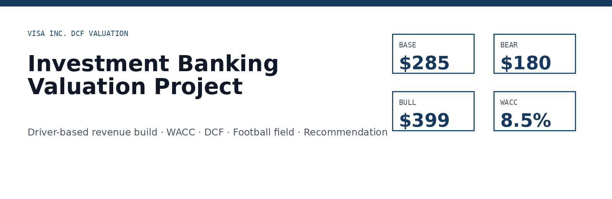
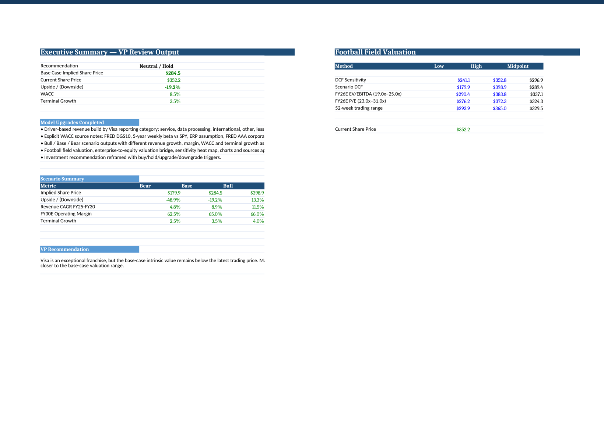
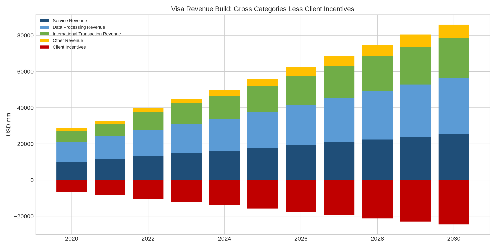
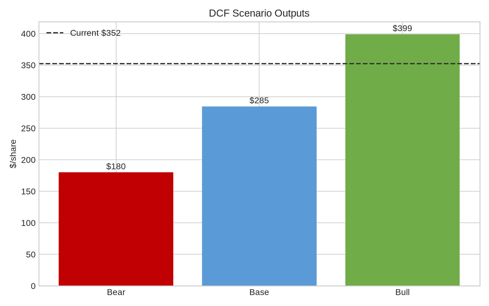
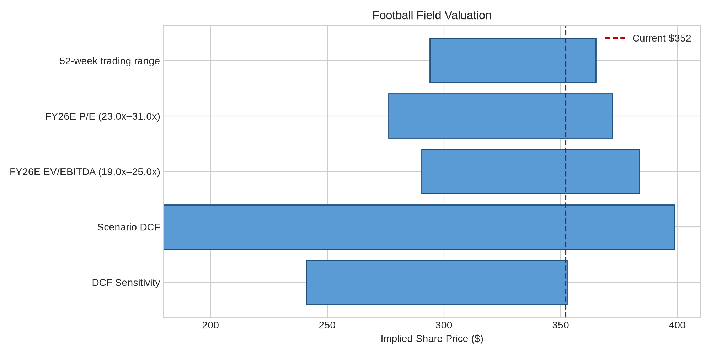
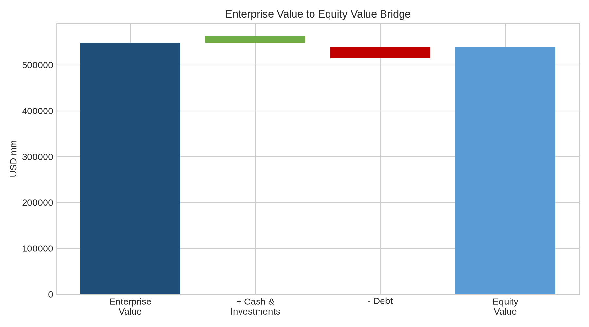

---

<div align="center">

[📊 Portfolio Home](../) &nbsp;·&nbsp; [NVIDIA Comparable Analysis →](../02-nvidia-comparable-analysis/)

</div>

# Visa Inc. DCF Valuation Model



[](model/Visa_DCF_Model.xlsx)
[](report/Visa_DCF_Report.pdf)
[](#)
[](LICENSE)

A professional investment banking-style DCF valuation of **Visa Inc. (NYSE: V)** featuring a driver-based revenue build, WACC analysis, DCF valuation, Bull/Base/Bear scenarios, football field, sensitivity analysis, and investment recommendation.



## Table of Contents

- [Project Highlights](#project-highlights)
- [Features](#features)
- [Methodology](#methodology)
- [Charts](#charts)
- [Excel Model Overview](#excel-model-overview)
- [Project Structure](#project-structure)
- [Results](#results)
- [Key Assumptions](#key-assumptions)
- [How to Use](#how-to-use)
- [Data Sources](#data-sources)
- [Disclaimer](#disclaimer)
- [License](#license)

## Project Highlights

- Built a full DCF model for Visa with historical financials, driver-based revenue forecast, WACC, terminal value, sensitivity analysis, and recommendation.
- Upgraded the model to a recruiting-ready investment banking format with scenarios, football field, valuation bridge, and source appendix.
- Packaged the project for GitHub and LinkedIn with a premium PDF report, screenshots, charts, and clear repository structure.

## Features

- **Excel valuation model** with industry-standard formatting and clear assumptions.
- **Revenue build** by Visa reporting category: Service, Data Processing, International Transaction, Other Revenue, less Client Incentives.
- **WACC analysis** with explicit public-source notes.
- **Bull / Base / Bear scenarios** with different growth, margin, WACC, and terminal growth cases.
- **DCF valuation** using mid-year convention and Gordon Growth terminal value.
- **Football field valuation** using DCF sensitivity, scenario DCF, trading range, and illustrative multiple ranges.
- **Sensitivity analysis** with professional heat-map formatting.
- **Premium institutional PDF** suitable for recruiter review.

## Methodology

The valuation uses a five-year explicit forecast period and derives enterprise value from discounted unlevered free cash flows plus a Gordon Growth terminal value. Equity value is calculated by adding cash and investment securities and subtracting total debt. The model triangulates intrinsic value through DCF, scenario analysis, football field valuation, and sensitivity tables.

## Charts

| Chart | Preview |
|---|---|
| Revenue Build |  |
| Scenario Outputs |  |
| Football Field |  |
| Valuation Bridge |  |

## Excel Model Overview

Recommended screenshot order for reviewers:

1. **Cover** — establishes the project as a polished investment banking work product.
2. **Executive Summary** — shows recommendation, valuation result, scenario summary, and VP-level framing.
3. **Revenue Build** — demonstrates that the forecast is driver-based rather than a simple top-down growth assumption.
4. **WACC** — shows explicit sourcing and cost of capital logic.
5. **DCF** — displays the core valuation mechanics.
6. **Football Field** — provides triangulation across valuation methodologies.
7. **Sensitivity** — highlights range-based thinking and downside/upside awareness.
8. **Scenarios / Recommendation** — shows judgment under Bear/Base/Bull cases.

## Project Structure

```text
Visa_DCF/
├── README.md
├── LICENSE
├── model/
│   └── Visa_DCF_Model.xlsx
├── report/
│   ├── Visa_DCF_Report.pdf
│   └── Visa_DCF_Report.md
├── charts/
│   ├── visa_revenue_build.png
│   ├── visa_scenarios.png
│   ├── visa_football_field.png
│   └── visa_valuation_bridge.png
├── images/
│   ├── hero_banner.png
│   ├── hero_screenshot.png
│   └── screenshots/
├── data/
│   └── README.md
└── sources/
    └── SOURCES.md
```

## Results

| Case | Implied Share Price | Upside / (Downside) |
|---|---:|---:|
| Bear | ~$180 | ~(49%) |
| Base | ~$285 | ~(19%) |
| Bull | ~$399 | ~13% |

**Recommendation:** Neutral / Hold. Visa is a high-quality franchise, but the base-case valuation indicates limited upside at the current trading level.

## Key Assumptions

- Base-case WACC: **~8.5%**
- Base-case terminal growth: **3.5%**
- Revenue CAGR FY25–FY30E: **~8.9%**
- FY30E operating margin: **~65.0%**
- Tax rate: **19.0%**

## How to Use

1. Open `model/Visa_DCF_Model.xlsx`.
2. Review the `Assumptions`, `Revenue Build`, `Scenarios`, `WACC`, and `DCF` tabs.
3. Flex key drivers such as revenue growth, operating margin, WACC, and terminal growth.
4. Read `report/Visa_DCF_Report.pdf` for the full investment thesis and valuation discussion.

## Data Sources

- Visa FY2025 Form 10-K and latest Form 10-Q.
- SEC Company Facts API.
- Yahoo Finance chart data for share price and beta series.
- FRED DGS10 for risk-free rate.
- FRED ICE BofA AAA Corporate Effective Yield for cost of debt proxy.

## Disclaimer

This project is for educational and recruiting portfolio purposes only. It is not investment advice, a recommendation to buy or sell securities, or a representation of any employer or financial institution.

## License

This repository is released under the MIT License. See [LICENSE](LICENSE) for details.

---

<div align="center">

[📊 Portfolio Home](../) &nbsp;·&nbsp; [NVIDIA Comparable Analysis →](../02-nvidia-comparable-analysis/)

</div>
