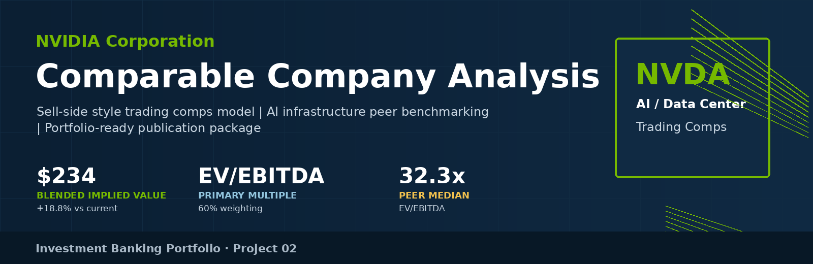
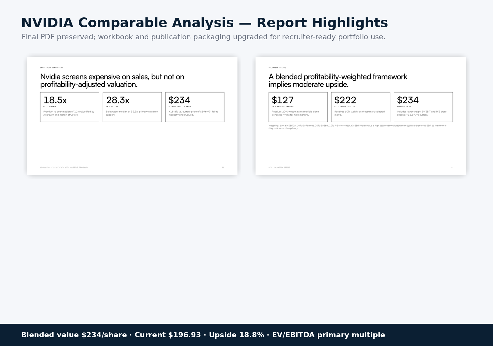
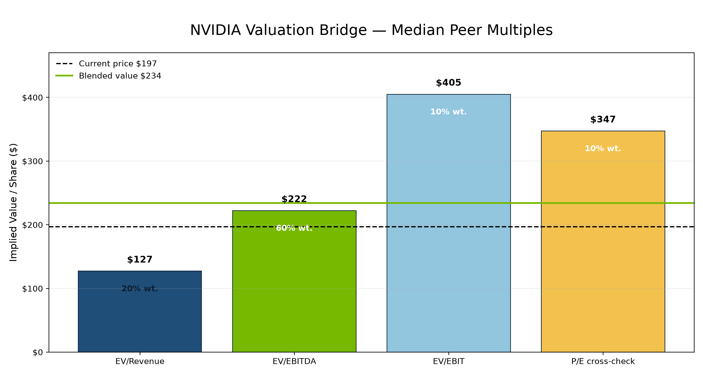
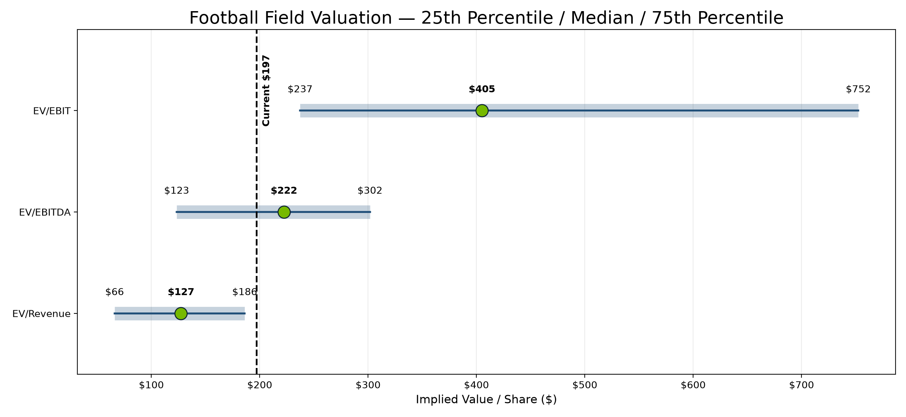
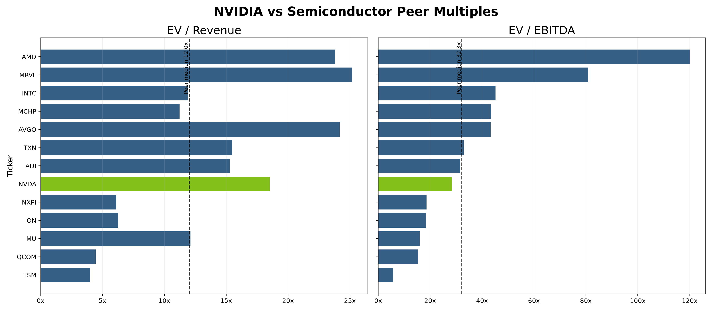
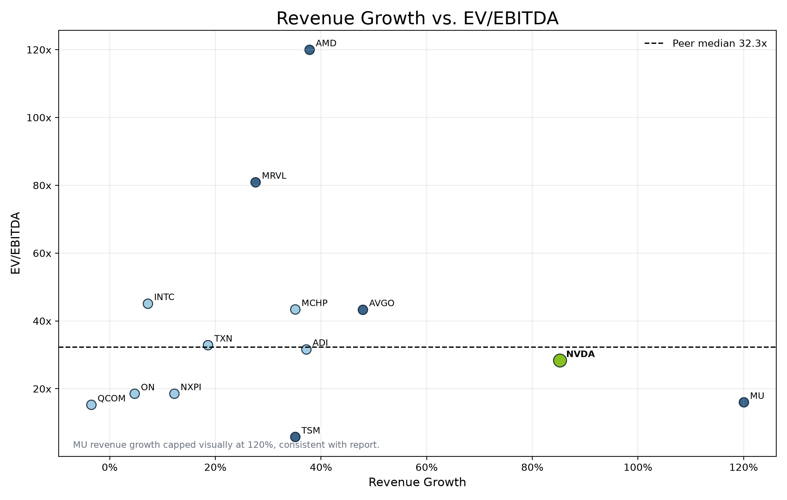

<div align="center">

[← Visa DCF Valuation](../01-visa-dcf/) &nbsp;·&nbsp; [📊 Portfolio Home](../) &nbsp;·&nbsp; [Microsoft Equity Research →](../03-microsoft-equity-research/)

</div>

---

# NVIDIA Corporation Comparable Company Analysis



[](model/Nvidia_Comparable_Company_Analysis_Model.xlsx)
[](report/Nvidia_Comparable_Company_Analysis_Report.pdf)
[](#)
[](#)

A professional investment banking-style **comparable company analysis of NVIDIA Corporation (NASDAQ: NVDA)** benchmarked against semiconductor, AI infrastructure, memory, networking, and advanced foundry peers. The project includes a publication-ready Excel model, final sell-side style PDF report, valuation bridge, football field, operating benchmark diagnostics, and source documentation.



## Table of Contents

- [Project Highlights](#project-highlights)
- [Features](#features)
- [Methodology](#methodology)
- [Charts](#charts)
- [Excel Model Overview](#excel-model-overview)
- [Project Structure](#project-structure)
- [Results](#results)
- [Key Assumptions](#key-assumptions)
- [Publication Package](#publication-package)
- [How to Use](#how-to-use)
- [Data Sources](#data-sources)
- [Disclaimer](#disclaimer)
- [License](#license)

## Project Highlights

- Built a sell-side style trading comps framework for NVIDIA across a selected semiconductor / AI infrastructure peer universe.
- Preserved the final investment conclusion from the reviewed PDF: NVIDIA is **fair to modestly undervalued** on profitability-adjusted relative valuation.
- Upgraded the Excel model for portfolio publication with improved navigation, source traceability, formatting consistency, and formula transparency.
- Packaged the project for GitHub with a Visa-consistent repository structure, hero visuals, charts, screenshots, publication assets, and LinkedIn-ready copy.

## Features

- **Excel comparable company model** with peer universe, trading multiples, operating benchmarks, valuation bridge, assumptions, and sources.
- **Peer universe** split between core AI / data-center comparables and broader semiconductor quality controls.
- **Multiple framework** covering EV/Revenue, EV/EBITDA, EV/EBIT, P/E, and PEG.
- **Profitability-adjusted valuation bridge** using EV/EBITDA as the primary selected multiple.
- **Football field valuation** showing 25th percentile, median, and 75th percentile implied share price ranges.
- **Scatter diagnostics** for growth vs. multiple and margin vs. multiple context in the final report.
- **Final sell-side PDF report** preserved without redesigning the thesis or valuation conclusion.

## Methodology

The analysis uses a selected public-company peer set focused on economic exposure rather than a simple GICS-only screen. NVIDIA is shown as the subject company but excluded from peer statistics. Median peer multiples are used because semiconductor earnings distributions are skewed by cycle timing, temporary margin troughs, and outlier profitability.

The valuation bridge weights the median-implied outputs as follows: **60% EV/EBITDA**, **20% EV/Revenue**, **10% EV/EBIT**, and **10% P/E cross-check**. EV/EBITDA receives the highest weight because it captures scale profitability, is capital-structure neutral, and is more analytically relevant than sales alone for NVIDIA's margin profile.

## Charts

| Chart | Preview |
|---|---|
| Valuation Bridge |  |
| Football Field |  |
| Multiple Comparison |  |
| Growth vs. EV/EBITDA |  |

## Excel Model Overview

Recommended screenshot order for reviewers:

1. **Cover & Index** — establishes the model as a navigable, recruiter-ready work product.
2. **Executive Summary** — shows preserved conclusion, selected methodology, blended value, current price, and implied upside.
3. **Comps Data** — displays peer universe, market data, trading multiples, and operating benchmarks.
4. **Valuation Bridge** — shows percentile ranges, median-implied values, preserved weights, and weighted contribution formulas.
5. **Methodology** — documents peer selection, EV/EBITDA rationale, median-vs-mean rationale, and sources.
6. **Assumptions & Sources** — adds valuation date, last updated date, key assumptions, model policy, and source trail.

## Project Structure

```text
02-nvidia-comparable-analysis/
├── README.md
├── LICENSE
├── model/
│   └── Nvidia_Comparable_Company_Analysis_Model.xlsx
├── report/
│   ├── Nvidia_Comparable_Company_Analysis_Report.pdf
│   └── Nvidia_Comparable_Company_Analysis_Report.md
├── charts/
│   ├── nvidia_valuation_bridge.png
│   ├── nvidia_football_field.png
│   ├── nvidia_multiple_comparison.png
│   └── nvidia_growth_vs_ev_ebitda.png
├── images/
│   ├── hero_banner.png
│   ├── hero_screenshot.png
│   └── screenshots/
├── assets/
│   ├── github_social_preview.png
│   ├── linkedin_featured_card.png
│   ├── repository_thumbnail.png
│   ├── LINKEDIN_PACKAGE.md
│   └── PUBLICATION_ASSETS.md
└── sources/
    └── SOURCES.md
```

## Results

| Metric | Output |
|---|---:|
| Current Share Price | $196.93 |
| Blended Implied Value / Share | $234.05 |
| Implied Upside / (Downside) | 18.8% |
| EV/Revenue Peer Median | 12.0x |
| EV/EBITDA Peer Median | 32.3x |
| EV/EBIT Peer Median | 68.9x |

**Recommendation / conclusion:** Fair to modestly undervalued on profitability-adjusted relative valuation.

## Key Assumptions

- Peer statistics exclude NVIDIA as the subject company.
- Selected peer universe and weighting methodology are preserved from the final reviewed analysis.
- Primary selected multiple: **EV/EBITDA**.
- Valuation weighting: **60% EV/EBITDA**, **20% EV/Revenue**, **10% EV/EBIT**, **10% P/E cross-check**.
- Valuation date: **July 2026**.
- Last updated: **08 July 2026**.

## Publication Package

This repository includes a full publication package for portfolio and LinkedIn use:

- `assets/github_social_preview.png` — recommended GitHub social preview.
- `assets/repository_thumbnail.png` — thumbnail for portfolio cards or project directories.
- `assets/linkedin_featured_card.png` — LinkedIn featured media image.
- `assets/LINKEDIN_PACKAGE.md` — project description, GitHub description, short portfolio copy, media titles, media descriptions, and featured-ready text.
- `assets/PUBLICATION_ASSETS.md` — badge markdown and asset usage notes.

## How to Use

1. Open `model/Nvidia_Comparable_Company_Analysis_Model.xlsx`.
2. Start with `0. Cover & Index`, then review `1. Executive Summary`, `2. Comps Data`, and `3. Valuation Bridge`.
3. Read `report/Nvidia_Comparable_Company_Analysis_Report.pdf` for the final sell-side style publication.
4. Use `assets/` for GitHub preview, portfolio thumbnails, and LinkedIn publishing.

## Data Sources

- Yahoo Finance / yfinance market data pull, accessed 7–8 July 2026.
- NVIDIA FY2026 fourth-quarter / fiscal-year results release and related SEC filings.
- Peer company latest available public filings, company-reported financial statements, and data-provider normalized metrics.
- See `sources/SOURCES.md` for the full source trail and model notes.

## Disclaimer

This project is for educational and recruiting portfolio purposes only. It is not investment advice, a recommendation to buy or sell securities, or a representation of any employer or financial institution. Refresh prices and filings before investment use.

## License

This repository is released under the MIT License. See [LICENSE](LICENSE) for details.

---

<div align="center">

[← Visa DCF Valuation](../01-visa-dcf/) &nbsp;·&nbsp; [📊 Portfolio Home](../) &nbsp;·&nbsp; [Microsoft Equity Research →](../03-microsoft-equity-research/)

</div>
